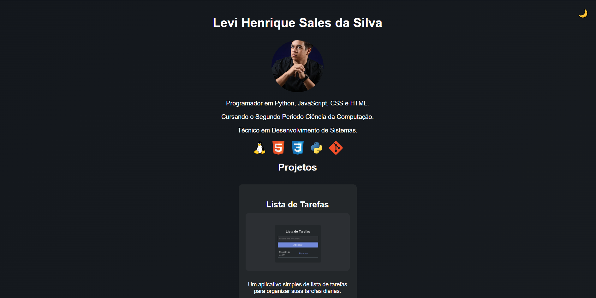

# Portfólio Pessoal

Este é o meu portfólio pessoal, onde apresento meus projetos e tecnologias que utilizo no desenvolvimento de software. O portfólio é uma aplicação web simples que exibe informações sobre mim e os projetos nos quais trabalhei.

## Funcionalidades

- **Troca de Tema**: O portfólio possui um botão que permite alternar entre os modos claro e escuro. O ícone no botão muda de acordo com o tema (lua para o modo escuro e sol para o modo claro).
- **Ícones das Tecnologias**: Utilizei ícones representativos para as tecnologias que uso, como Linux, HTML, CSS, Python e Git.
- **Exibição de Projetos**: A página exibe uma lista dos meus projetos mais recentes, com imagens ilustrativas e links diretos para os repositórios no GitHub.
- **Animação de Fundo**: A página possui um efeito de animação de gradiente no fundo que muda suavemente ao longo do tempo.

## Tecnologias Utilizadas

- **HTML5**: Para a estruturação do conteúdo da página.
- **CSS3**: Para a estilização da página, incluindo suporte a temas claro e escuro.
- **JavaScript**: Para adicionar interatividade, como a troca de temas.
- **Devicon**: Para os ícones das tecnologias que utilizo (Linux, HTML, CSS, Python e Git).

## Como Usar

1. **Clone o Repositório**:
    ```bash
    git clone https://github.com/levi985/levi985.github.io
    ```

2. **Abra o arquivo `index.html` em seu navegador** para visualizar o portfólio.

## Projetos Incluídos

- **[Lista de Tarefas](https://github.com/levi985/Lista-de-tarefas-)**: Um aplicativo simples de lista de tarefas para organizar suas atividades diárias.
- **[Conversor de Moedas](https://github.com/levi985/conversor-de-moedas)**: Um conversor de moedas simples e fácil de usar.
- **[FitLife](https://levi985.github.io/Fitilife/)**: Um site sobre saúde e bem-estar.
- **[Linux Install Script](https://github.com/levi985/linux-install-script)**: Um script em Shell para automatizar a instalação de programas populares no Linux.
- **[Linketree](https://levi985.github.io/linketree/)**: Uma página com meus principais links de redes sociais e projetos.

## Captura de Tela

Abaixo uma imagem de demonstração do portfólio:



## Contribuições

Se você quiser sugerir melhorias ou relatar bugs, fique à vontade para abrir uma issue ou fazer um pull request.

---

Sinta-se à vontade para visitar o [meu portfólio](https://levi985.github.io/) e conhecer mais sobre o meu trabalho!
